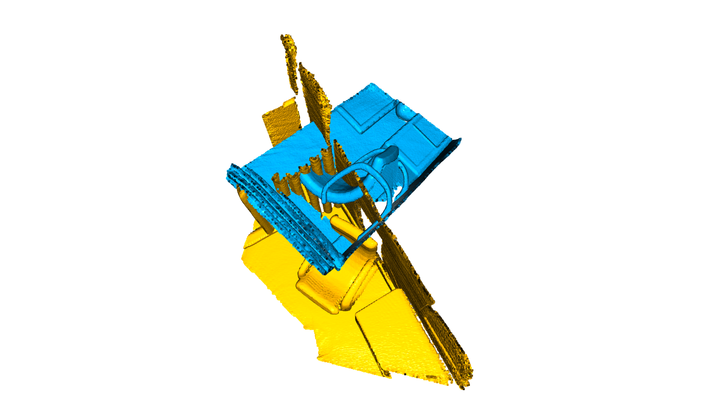
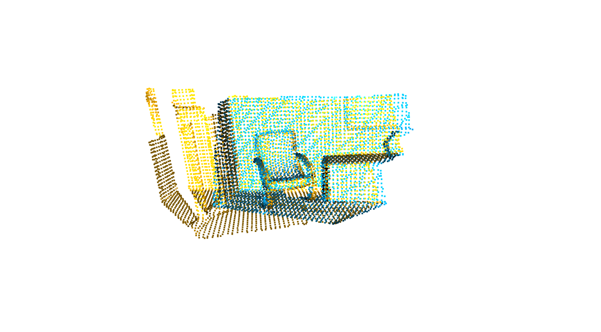

# PointCloud_registration
This work is based on [ICP registration tutorial](http://www.open3d.org/docs/latest/tutorial/Basic/icp_registration.html).
## Usage
```geometric_features.py``` allows to visualize and extract the geometric features of the source point cloud (in yellow) as well as the target (in blue).
```bash
python geometric_features.py --voxel_size [default value is 0.05]
```

### Global registration
Random sample consensus (RANSAC) is used to perform global registration. In each RANSAC iteration, random points are picked from the source point cloud. Their corresponding points in the target point cloud are detected by querying the nearest neighbor in the 33-dimensional [FPFH](https://pcl.readthedocs.io/projects/tutorials/en/latest/fpfh_estimation.html) feature space. ```ransac.py``` in the open3d implementation of this algorithm.
```bash
python ransac.py --voxel_size [default value is 0.05]

```

